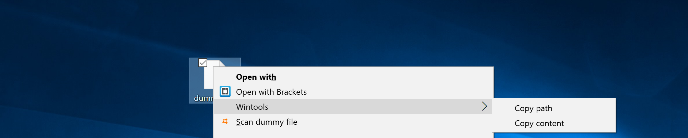

# Wintools
Wintools allows to enhance Windows contextual menu (right-click) with some cool functionalities

## How to install

I built a ready-to-use executable that should work on Windows 2000 and above, which you'll find here in **/build**

Run as administrator, do not move the file from where you launched it, and you're good to go :)

If you want to build it on your own, give a look to the Miscellaneous section.

## What does it look like 

 

## Functionalities

**Wintools** will add a contextual cascading menu in two cases:
- **Right click on a file** : 
	- You can copy to your clipboard what's inside this file.
	- You can copy to your clipboard the absolute path of this file.
	- You can paste the content of your clipboard inside this file.
- **Right click on a directory**:
	- You can copy to your clipboard the absolute path of this directory.
	- You can open a shell with this directory as current working directory.

## Usage

Just download the file **Wintools.exe**, place it somewhere you'll **never move it**, and run it as **administrator** only once. You're ready to go by now, right click somewhere :)  
It is crucial that you execute it with administrator privileges as this program modifies Windows registry keys.

If you'd like to uninstall it, once again as **administrator** , type the following :

    $ Wintools /u

This will delete the custom registry keys created by Wintools.

##  Miscellaneous

- You should be able to build it easily if you're not confident with my own distribution. **It's a single C file with no dependencies.**

- There might be caveats with very large files (> 4GB)
- There might be caveats with particular file formats such as **.docx & .pdf** ones as **Wintools works in string mode** when it comes to copy file content to clipboard.

## Contribute

- You're free to open PRs and issues which I will review and integrate into the project.
- Tell me about features you'd like to have in your contextual menu.
